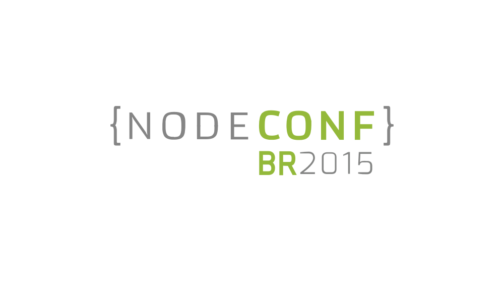

==========

Este repositório tem como objetivo servir de HQ para a organização comunitária
da **NodeConf BR 2015**.

### Como colaborar

Qualquer pessoa interessada em ajudar pode acessar as [issues][0] e começar a
participar ativamente da resolução de problemas e decisões da conferência.

### Call For Papers ABERTO
Aqueles interessados em enviar propostas para a NodeConfBR já estão abertas as incrições. Só entrar neste [link][6] e se inscrever.

### Canais de comunicação

  * A [página de issues][0] é nosso canal oficinal para tomada de decisões e
  discussões em geral. Sinta-se a vontade para abrir uma nova issue caso ache
  necessário.

  * O [Gitter][1] também pode ser usado quando houver necessidade de comunicação
  em tempo real, mas todas as decisões tomadas deverão ser transcritas para
  as issues.

### Principais tópicos

  * [Local do evento][2]: ajude a definir a localização do evento.
  * [Data do evento][3]: 7 e 8 de Novembro de 2015.
  * ~~[Logotipo][4]: ajude a definir a identidade visual da conferência.~~
  * [Organização e organizadores][5]: como o evento deve ser organizado? Quem
  são as pessoas responsáveis por cada aspecto do evento?

### Comitê de organização

#### Programação
* [Marcos Bérgamo](http://twitter.com/thebergamo)

#### Comercial 
* [David Lojudice Sobrinho](http://twitter.com/dalssoft)
* [Heitor Sergent](http://twitter.com/heitorburger)

#### Financeiro 
* [Gabriel Marquez](http://twitter.com/gblmarquez)
* [Eric Douglas](http://twitter.com/ericdouglas_)

#### Infraestrutura
* [Willian Renato Sabião](http://twitter.com/willianjedai)

#### Organização
* [Alan Hoffmeister](http://twitter.com/alan_hoff)

### Licença ISC

Copyright (c) 2015, NodeBR <nodebr@nodebr.org>

Permission to use, copy, modify, and/or distribute this software for any purpose
with or without fee is hereby granted, provided that the above copyright notice
and this permission notice appear in all copies.

THE SOFTWARE IS PROVIDED "AS IS" AND THE AUTHOR DISCLAIMS ALL WARRANTIES WITH
REGARD TO THIS SOFTWARE INCLUDING ALL IMPLIED WARRANTIES OF MERCHANTABILITY AND
FITNESS. IN NO EVENT SHALL THE AUTHOR BE LIABLE FOR ANY SPECIAL, DIRECT,
INDIRECT, OR CONSEQUENTIAL DAMAGES OR ANY DAMAGES WHATSOEVER RESULTING FROM LOSS
OF USE, DATA OR PROFITS, WHETHER IN AN ACTION OF CONTRACT, NEGLIGENCE OR OTHER
TORTIOUS ACTION, ARISING OUT OF OR IN CONNECTION WITH THE USE OR PERFORMANCE OF
THIS SOFTWARE.

[0]: https://github.com/nodebr/nodeconfbr/issues
[1]: https://gitter.im/nodebr/nodeconfbr?utm_source=badge&utm_medium=badge&utm_campaign=pr-badge&utm_content=badge
[2]: https://github.com/nodebr/nodeconfbr/issues/8
[3]: https://github.com/nodebr/nodeconfbr/issues/9
[4]: https://github.com/nodebr/nodeconfbr/issues/6
[5]: https://github.com/nodebr/nodeconfbr/issues/7
[6]: http://br.nodeconf.org
